# Introduction

The linguistic scenario in Italy is extremely rich and characterized by a large number of Romance glossolects, which coexist alongside Italian (itself a Romance glossolect).
We use here the term *glossolect* to indicate a linguistic system based on a set of doculects (i.e. a linguistic entity as it is mentioned, attested, documented and/or described in a specific resource) and can refer to any of a macro-family, a family, a dialect continuum, a linkage, a language, a variety, an idiolect, etc ([@coretta2024], cf. *languoid* [@cysouw2013]).
In other words, the term glossolect allows us to delimit and specify the linguistic system(s) we are referring to, without committing to a specific view of how these systems are internally and externally organised.
This terminological choice removes us from debates on what constitutes different languages or varieties/dialects of a single language [@vanrooy2021].
We will still use the term "language" when we refer to a linguistic system without making reference to ontological aspects of delimitation, classification or genealogy, such as when talking more generally about language, as in terms like "language vitality and endangerment", "language policy and maintenance" and so on, and when reporting the results of this study.

Given the urgency of assessing the linguistic vitality of Northern Italy, in this paper we prioritise breadth over depth.
This is because, were the analysis to proceed at the degree of granularity often pursued in traditional dialectological practice (for example, requiring the classification and sufficient description of each individual glossolect), an initial assessment of linguistic vitality in the area would remain out of reach.
For example, the existence of complex internal relationships, such as those between eastern and western Lombard varieties and the transitional position of Pavese, would stifle any such advancement.
The notion of glossolect is employed both to advance a non-binary, recursively structured view of language and to serve as a pragmatic tool for delineating a complex and internally diverse linguistic landscape, while maintaining a neutral position in relation to ongoing debates within this contested domain.
We do not approach Gallo-Romance of Northern Italy as a homogeneous entity at any given level of linguistic enquiry.

The minoritised Romance glossolects of Italy are traditionally referred to in the literature as "primary dialects of Italy" [@telmon2017dialects 487] or "Italian dialects" (e.g. [@ledgeway2003linguistic; @cortelazzo1998dialetti]).
However, this terminology is misleading from a historical point of view: these Romance glossolects are not varieties of Italian, in the sense that they have not developed from Italian, but rather they developed independently from Latin, just like French, Spanish, or Romanian (see [@maidenandparry1997] for an overview).
They should therefore not be confused with Regional Italian ([@berruto1989main; @berruto1993varieta]; check @berruto2018), which is the umbrella term that is used to refer to the actual varieties of Italian spoken throughout the Italian peninsula (comparable to present-day varieties of English).
The term "Italian dialects" reflects long-standing political and ideological assumptions, rather than historically-oriented linguistic classification.
To acknowledge both the historical use of the term in Italian scholarship and its contested nature, @tamburelliandtosco refer to these glossolects as "contested languages".
This label draws attention to the complex and politicized status of these glossolects in relation to the national glossolect, Italian.

Among the contested and recognised glossolects of Italy, this paper focuses specifically on a subgroup that belongs to what we call the Gallo-Romance glossolect of Northern Italy, which is spoken in the northern part of Italy, San Marino, and parts of southern Switzerland, and notably excludes Italian.
This area largely corresponds to the region north of the Massa--Senigallia isogloss bundle [@maidenandparry1997; @beninca2016].
While this group includes the traditionally recognized Gallo-Italic glossolects (Piedmontese, Lombard, Ligurian, Emilian, and Romagnol) it also encompasses the other Romance glossolects spoken in the north: Venetan, Friulian, Ladin, Romansh, Franco-Provençal, and Occitan (see @fig-gr, cf. [@de2020debunking]).
We will thus use the geographical term "Gallo-Romance of Northern Italy" to refer to Gallo-Romance spoken in the area that covers the administrative regions of Piedmont, Liguria, Lombardy, Emilia-Romagna, Trentino-Alto Adige, Veneto, and Friuli Venezia-Giulia, with partial presence in Marche and the Swiss cantons of Ticino and Grisons (@fig-geo).
At a typological level, these varieties share core structural traits with the Western and Northern Romance continuum [@zamboni1998; @renziandreose2015], linking them more closely to glossolects such as French, Occitan, and Catalan than to Italian.

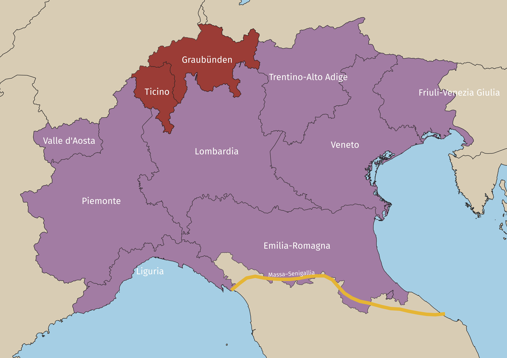{#fig-geo width="80%"}

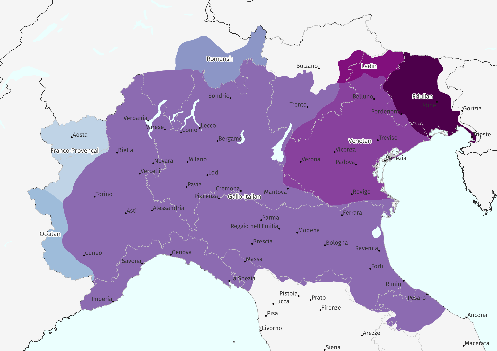{#fig-gr width="80%"}

Following the trajectory of language endangerment world-wide, the vast majority of the contested glossolects of Italy are doomed to disappear at the turn of the next century.
Italian, being perceived as the language of socio-economic advancement, is gradually replacing these contested glossolects, which are not able to cope with modernity and the increased social mobility of its speakers.
This process of language shift [@fishman1991reversing; @fishman2001a] towards the dominant national language has roughly started around the 1960s with the consolidation of compulsory education and Italy's sharp industrialisation [@demauro2011].

The Italian national law 482 of the 15th of December 1999 (*Norms on the Matter of Protection of Historical Linguistic Minorities*) recognises only twelve of these spoken glossolects as languages and indicates the modality for their safeguard.
The Law 482/1999 does not do justice to the richness inventory of Romance glossolects spoken in the Italian peninsula and many contested glossolects remain understudied and under-protected.
Among the Gallo-Romance glossolects of Northern Italy, two exceptions that are legally-recognised received relatively more attention are Ladin [@videsott2020manuale] and Friulian.
On the latter, @de2021conundrum argues that, despite its legal status, Friulian is a *definitely endangered* glossolect with reference to the UNESCO's [-@unesco2003; -@unesco2011] factors of language vitality.
Other non-legally recognised glossolects of Gallo-Romance of Northern Italy that received scholarly attention with respect to their vitality are Piedmontese, Lombard, Emilian, and Venetan [@coluzzi2009endangered; @coluzzi2008language; @coluzzi2007minority; @de2022fading; @hampton2024language; @soria2016speakers; @ursini2012sono].
Although different methodologies were used to administer these language vitality surveys, the results show that the aforementioned glossolects of Gallo-Romance of Northern Italy are characterised by a poor vitality.

The present study aims to provide a broader and more systematic global assessment of the vitality of the Gallo-Romance glossolects of Northern Italy, contributing to the social and theoretical understanding of language shift in contested linguistic ecologies.
The study, in fact, offers a consistent data collection methodology for these glossolects in the defined geographic area, thus providing an average vitality assessment of what we recognise to be a heterogenous linguistic landscape.
While the concept of endangerment is usually ascribed to specific "languages" or "dialects", in light of the approach delineated at the beginning of this section, it is important to note that we are in no way implying that Gallo-Romance of Northern Italy is a "language" in opposition to language family, branch or else.
Instead, we consider Gallo-Romance of Northern Italy to be a glossolect based on a well-defined linguistic area that comprises different and possibly independent speech communities that nonetheless share enough features to be considered together.
This allows us to maintain the scope of the vitality report manageable in a single academic article.
Future work is needed to investigate vitality from a more fine-grained perspective.

The paper is structured as follows: in Section 2, we will more broadly frame and define language vitality and language endangerment within our study; Section 3 outlines our methodology, as well as our operationalisation of the [@unesco2003; @unesco2011] factors of language vitality; Section 4 looks at each individual factor in detail, commenting on the results of our survey; Section 5 proposes and discusses an overall score of language vitality based on these factors; Section 6 concludes the paper.

# Language vitality and language endangerment

One way to understand language is to view the world's linguistic repertoire as a reflection of what it means to be human in all its diversity and potential.
This perspective draws on the metaphor of biodiversity, mapping the positive connotations associated with the variety of species in the natural world onto the realm of human languages.
As with biological diversity, linguistic diversity emerges from a complex web of interconnected factors.
Depending on the criteria adopted to classify glossolects, estimates suggest that more than 6,000 glossolects are currently spoken worldwide [@sallabank2013attitudes; @tsunoda2006language].
Yet, by the end of this century, more than 90% of these may disappear [@piirainen2015language; @krauss2008], leading to a dramatic reduction in our planet's linguistic diversity.

The metaphor of biodiversity is especially useful in illustrating the implications of language loss insofar that just as the extinction of a species is considered a loss for the planet, the death of a language can be seen as the loss of a unique human perspective.
Language death, then, becomes not only a linguistic issue but a matter of cultural, cognitive, and epistemological significance.
Preserving diverse languages means preserving diverse ways of being, knowing, and relating to the world; a goal that can be considered intrinsically valuable [cf. @maffi2002a].
This is especially important at a time of ecological crisis when the cultivation of a pluralistic world is fundamental in the search for a future that is aligned with the needs of the planet.

From this viewpoint, human language is not merely worth exploring for its structural properties---such as syntax ---but also for the unique knowledge systems it encodes.
Each language constitutes part of the broader repertoire of human expression and understanding, and the death of a language "includes the displacement of knowledge, ways of knowing, and habits of mind" [@piirainen2015language 3].
Preserving linguistic diversity thus means safeguarding our past, our present, and our future.
It is no surprise, then, that the loss of a specific language is often experienced by speakers as a profound rupture in intergenerational continuity.
As @fishman2001a [5] poignantly puts it, language is the "'essential' bodily inheritance that one generation passes on to the next."

In the introduction to their edited volume, @heller2008a highlight the biodiversity metaphor as one of the dominant tropes in contemporary discussions of minoritised languages.
They urge a critical engagement with these discursive practices, noting that such framings are not neutral but shaped by ideology and vested interests.
While these tropes are grounded in human language, the editors argue that the sense of urgency surrounding language loss---whether framed as a threat to diversity, heritage, knowledge, or equality---is ultimately about broader questions of social order and the organisation of everyday life.
Since its emergence as a field of concern, language endangerment has been framed in ways that range from a threat to human diversity, to a site of contestation between nation-states and minority communities, a human rights issue, and more recently, as a potential asset in accessing global markets (on these shifting framings, see @muehlmann2008a, @hobsbawm1990a, @skutnabb-kangas2000a, and @valle2008a, respectively).

Through this latter framing, it becomes clear that language loss is not only associated with the loss of biological diversity---both metaphorically and literally---but also deeply entangled with questions of power, inequality, and struggle under the current neoliberal order.
Just as approximately half of the world's wealth is concentrated in the hands of the top 1% of the global population [@zucman2019global], so too is linguistic inequality observable.
@crystal2002language notes that around 96% of the world's languages are spoken by just 4% of the global population.
This parallel highlights how both economic and linguistic marginalisation are symptomatic of broader systems that prioritise efficiency, uniformity, and dominance over sustainability, diversity, and equity.

As a symptom of this unequal distribution, most of the glossolects spoken by the 4% of the global population are now marked by weakening patterns of intergenerational transmission.
In other words, these glossolects are increasingly at risk of no longer being spoken as younger generations cease to acquire or use them in daily life.
This shift is rarely the result of individual choice alone; rather, as already hinted at above, it emerges from a complex interplay of sociopolitical and structural factors.
Communities may abandon their ancestral languages due to stigma and shame attached to their use [@sallabank2013attitudes], or because they lack access to the language in educational or institutional settings [@tsunoda2006language].
Confidence may erode in the absence of supportive environments, and a lack of teaching resources, institutional support, and formal recognition all contribute to diminished domains of use [@austin2011cambridge].
When a glossolect no longer serves practical functions---whether in education, work, governance, or media---its perceived value decreases.
As compellingly illustrated by @oceallaigh2022neoliberalism in the Irish context, when speakers see no viable future for Irish, especially in relation to economic mobility or social inclusion, the prospects for its survival diminish further.
These interconnected absences of function, opportunity, and prosperity, accelerate the shift toward dominant glossolects, reinforcing the structural pressures that marginalise non-dominant speech communities in the first place.

The weakening of intergenerational transmission lies at the core of declining language vitality---a concept widely used in both academic literature and language policy to assess a language's prospects for survival.
Vitality is shaped not only by numbers of speakers, domains, or transmission, but by the broader sociopolitical context in which a language is spoken or left behind.
It follows that endangerment, that is the degree of viability of the language [@tsunoda2006language 9], is not a neutral or natural process but deeply entwined with histories of minoritisation, marginalisation, and structural oppression.
The gradual disappearance of glossolects, also referred to as "language obsolescence" [@dorian1992investigating], carries profound consequences.
Culturally, it results in the loss of unique ways of knowing, practices, and epistemologies embodied through human language.
Politically, it represents the silencing of communities whose presence and perspectives are already pushed to the margins.
In this light, maintaining linguistic diversity is not only about preserving heritage, but about resisting cultural homogenisation and reclaiming space.
Research questions that can provide helpful insights into these dynamics can focus on the why and how communities manage to maintain their languages, even under conditions of pressure and erasure.
As will be discussed in Section [3.3](#vitscores){reference-type="ref" reference="vitscores"}, language vitality and endangerment can be measured through scales and frameworks such as @unesco2003, Expanded Graded Intergenerational Disruption Scale [@lewis2010], and @fishman1991reversing.

In contexts of unstable multilingualism, the transmission of a non-dominant or minoritised language through child--caregiver interaction is often a key predictor of whether the language will retain its vitality in the near future.
As discussed earlier, speakers may choose not to pass on their language for a range of reasons, shaped by both external pressures and internalised ideologies (see @austin2011cambridge 2011 for a detailed discussion of these factors).

In the Gallo-Romance-speaking areas of northern Italy, Switzerland, and San Marino, for instance, Italian---functioning as the national and institutional language---is widely associated with socio-political power, upward mobility, and access to education and culture.
In contrast, the perceived value of Gallo-Romance is often limited to their instrumental worth, that is what one can realistically achieve by speaking them [@grenoble2006saving].
When a language is no longer being transmitted to children, it is, for all practical purposes, already in the final stages of obsolescence---its full disappearance becoming a question of time, rather than possibility.
As argued by @winford2003introduction, the decision to withhold transmission marks the onset of serious language attrition, typically followed by an inevitable shift toward the dominant language.
Moreover, the absence of child speakers greatly complicates revitalisation efforts, as it deprives the language of its generational future [@grenoble2006saving].

The disappearance of child speakers is not always immediate or absolute.
In some cases, remnants of language use persist through what @dorian1981language described as semi-speakers---individuals who possess a partial, often unstable command of the language, typically without full grammatical or communicative proficiency.
As discussed, shifts in speaker profiles reveal that questions of language vitality are never merely academic but rather, they speak to broader patterns of inequality, marginalisation, and access to resources.
Understanding vitality is thus not only useful for assessing a language's current status but also crucial for shaping effective language planning and revitalisation strategies.
It enables researchers, communities, and policymakers to identify where intervention may be most impactful, whether by supporting child transmission, increasing institutional support, or sustaining new speaker communities.
Measuring vitality is far from straightforward.
It demands careful attention to sociolinguistic conditions and a commitment to independent, context-sensitive evaluation.
The following section turns to the frameworks and methods used to undertake such assessments.

# Methods

## Participants

We collected responses from a total of 2218 participants.
The participants were adults (18+ yo) who reside and/or were born in the Italian regions Val d'Aosta, Piemonte, Liguria, Lombardia, Emilia-Romagna, Veneto, Friuli-Venezia Giulia, Trentino, in the Swiss Cantons Ticino and Grigioni, and in San Marino (see [19](#apx:provinces){reference-type="ref" reference="apx:provinces"} for a list of provinces with response counts; provinces with no responses are not included).
Participants were recruited via social networks, calls sent to local administrations and relevant socio-cultural associations, and via word-of-mouth.
See [\[sec:akn\]](#sec:akn){reference-type="ref+Label" reference="sec:akn"} for a list of the main organisations and social media accounts that contributed to the dissemination of the questionnaire.
@fig-counts-comune shows a bubble map with counts of respondents by *comune* (i.e. municipality).

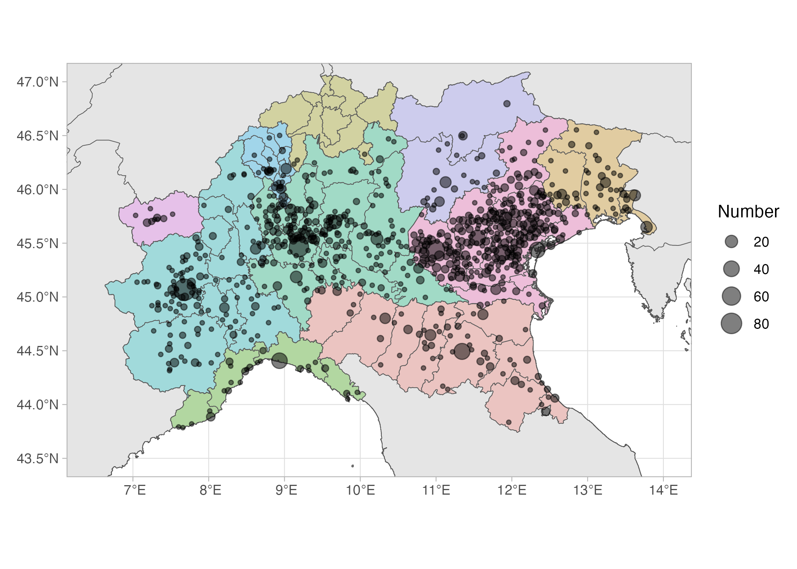{#fig-counts-comune width="80%"}

## Questionnaire structure

The questionnaires were delivered online, on the SoSci Survey platform (<https://www.soscisurvey.de>).
Participants that matched the inclusion criteria outlined in the previous section answered a series of questions.
The questions were divided into 7 groups based on the main vitality-related topic they cover.
The relevant groups are: location of birth and residence (LO), questions about the languages spoken by the participants, their parents and their children (LG), and questions about language use for those who understand Gallo-Romance in the spoken (LU) and written medium (RW).
The full list of questions can be found at <https://github.com/stefanocoretta/grni-vitality/blob/main/code/survey-questions.pdf>

## Operationalising vitality status {#vitscores}

There is not a single commonly accepted system for operationalising the vitality (or endangerment) status of a language (in other words, a system to assign a vitality status).
Different systems have been proposed in the literature, under the name of "scores", "indices" and "scales".
The aim of such systems is to enable researchers to assign a particular vitality status based on a definite set of criteria.
The systems proposed so far, to our knowledge are: [@unesco2003; @unesco2011; @lewis2010; @lee2016; @krauss2008; @hammarstrom2018; @lee2018a].
We refer the reader to @lee2016 for an overview.

We opted to operationalise vitality as the set of criteria defined in @unesco2003 and @unesco2011.
These criteria are presented in @tbl-vit-facs.
Each factor can be assigned a score from 0 to 5, with the exception of Factor 2 (see below for how we approached this).
Those factors whose ID starts with an "E" are from @unesco2011, the others are from @unesco2003.
Two factors from the Unesco list were further expanded by incorporating the numeric breakdowns from [@lee2016] for Factor 2 " Absolute number of speakers" (for each score from 0 to 6: 1-9 speakers; 10-99; 100-999; 1000-9999; 10,000--99,999; \> 100,000).
For Factor 3 "Proportion of speakers", we have converted the textual labels to actual percentages: None speaks the language (0%) Very few speak the language (0-19%), A minority speaks the language (20-49%), A majority speaks the language (50-79%), Nearly all speak the language (80-99%), All speak the language (100%).
Every other facto remains as described in [@unesco2003; @unesco2011].
Each factor was assessed individually, based on the responses collected with the questionnaire and/or based on our domain knowledge.

| Factor ID | Description                                                   |
|:----------|:--------------------------------------------------------------|
| 1         | Intergenerational language transmission                       |
| 2         | Absolute number of speakers                                   |
| 3         | Proportion of speakers                                        |
| 4         | Shifts in domains of language use                             |
| 5         | Response to new domains and media                             |
| 6         | Availability of materials for language education and literacy |
| 7         | Government and institutional attitudes and policies           |
| 8         | Community members' attitudes                                  |
| 9         | Type and quality of documentation                             |
| E10       | Status of language programmes                                 |
| E11       | Distribution of the language community                        |
| E12       | Degree of internal variation                                  |
| E13       | Transnational distribution of language                        |

: Vitality factors {#tbl-vit-facs}

## Data processing and plotting

All data processing and plotting was done in R v4.5.0 [@rcoreteam2025] using the tidyverse packages [@wickham2017; @wickham2019].

## Open Research and data availability

We are committed to research transparency and the Research Compendium of this project can be found at <https://github.com/stefanocoretta/grni-vitality> [@coretta2025a].
The Compendium includes data, R code and the figures of this paper (these can be found in `code/01-process-data.qmd` `code/04_vitality.qmd`).

# Factor 1: Intergenerational language transmission

The primary criterion for assessing the vitality of a language is its transmission across generations.
Crucially, even a language actively used by its community at present does not ensure long-term vitality if the speakers stop passing the language to future generations and the new generations shift to other languages.
The questions LG01-05 and LG11-12 were designed to enquire about the intergenerational transmission of contested Gallo-Romance.
The questions ask about the Romance glossolects spoken by the respondent's parents, by the respondent when they first acquired language as children, by the respondent to their children (if they had any), by the respondent's children presently (if they have any), and by the respondent to children if they had any.
The participants could choose between "Mostly Gallo-Romance", "Italian and Gallo-Romance equally" and "Mostly Italian".
Note that due to the common use of "dialect" to refer to contested glossolects in Italian, the questions actually used *dialetto* 'dialect' in place of "Gallo-Romance" for contested Gallo-Romance.

@fig-lang-acq shows the proportion of responses broken down by familial generation[^1] of the respondent: their parents, themselves, their children (further broken down by language spoken to and by the children, and to children if the respondent had any).
Leaving the "Would speak to children" aside for the moment, a clear pattern emerges by which Italian takes over from the oldest generation (the respondents' parents) to the youngest (the respondents' children).
The proportion of both "Italian and Gallo-Romance equally" and "Mostly GR" decreases through the generations.
We take this to indicate that the intergenerational transmission from (grand-)parents to (grand-)children has declined substantially, thus rising concerns regarding the stability of the population speaking Gallo-Romance.

[^1]: To differentiate between parent-child generations vs year-based generations (discussed below), we use "familiar generation" for the former and "cohort generation" for the latter.

{#fig-lang-acq width="\\linewidth"}

A different prospective is given in @fig-lang-acq-gens, where the data is broken down further based on the cohort generation of the respondents, based on their birth year as inferred by their age.
From left to right, and from oldest to youngest, the panels show the Silent (1925-45), Boomer (1946-64), X (1965-79), Millennial (1980-94) and Z (1995-2012) generations [@usclibguide_age].
Within each panel, the same grouping is given as in @fig-lang-acq, based on familial generation.
@fig-lang-acq-gens makes it clear how the distribution of responses based on familial generation changes through the cohort generations.
Of particular notice is how the difference in proportion of "Mostly Gallo-Romance" responses across familial generations decreases along the cohorts.

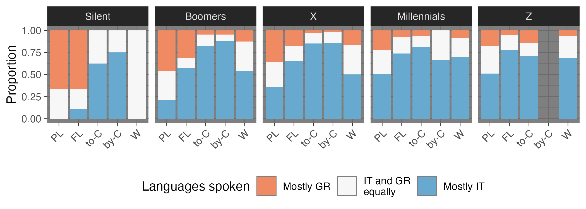{#fig-lang-acq-gens width="\\linewidth"}

::: {#fig-understand-speak}
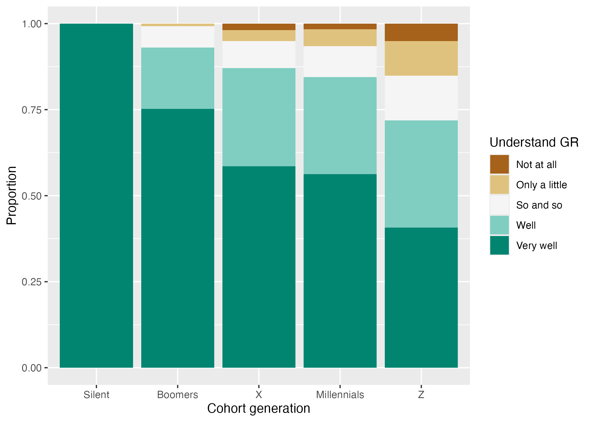{#fig-understand}

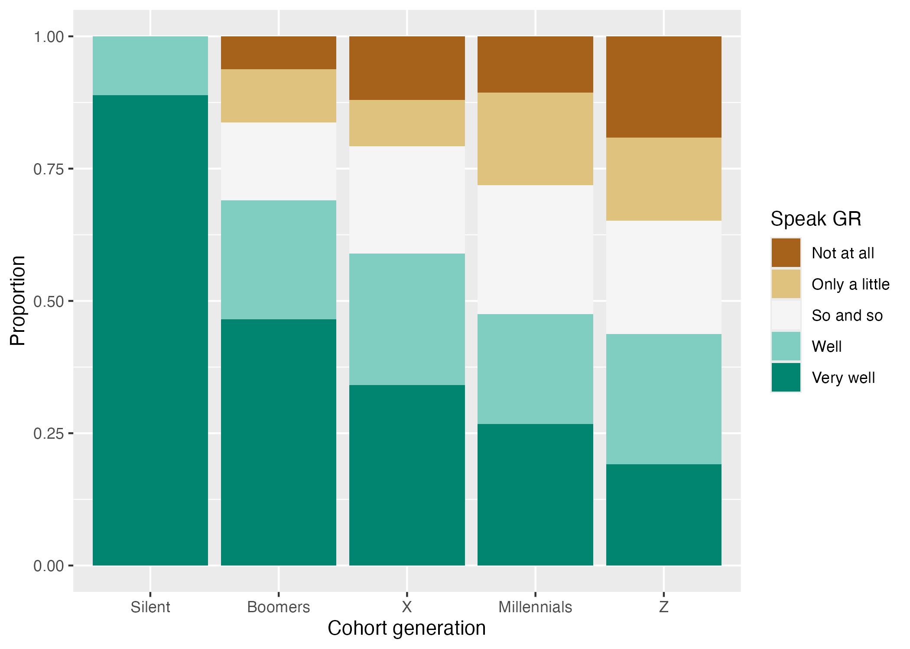{#fig-speak}

Proportion of understanding and speaking proficiency of Gallo-Romance by cohort generations.
:::

Two further questions focus on the self-reported proficiency in understanding (LG06, LG13) and speaking Gallo-Romance (LG07, LG14).
The participants were asked to self-rate their proficiency in the variety of Gallo-Romance spoken in the place of residence (LG06, LG07), or, if they did not reside within the target area but were born within it, to self-rate their proficiency in the variety of Gallo-Romance spoken in their birth-place (LG13, LG14).
The rating was a 5-point Likert scale: "Not at all", "Only a little", "So and so", "Well" and "Very well" (for both understanding and speaking).
@fig-understand-speak shows the proportion of responses for the understanding and speaking self-reported proficiency separately.
For both plots, the data is grouped based on cohort generation.

Both understanding and speaking proficiency clearly decline across cohort generations, although speaking proficiency is overall lower than understanding proficiency.
It can be observed that, by the Millennial and Z generations, 50% or less of the cohort speaks Gallo-Romance well or very well.

Based on the patterns presented in @fig-lang-acq and @fig-lang-acq-gens, and taking "parent generation" to mean the Millennials, we assign Factor 1 *Intergenerational language transmission* to "Severely endangered (2)": "The language is spoken only by grandparents and older generations; while the parent generation may still understand the language, they typically do not speak it to their children" [@unesco2003 8].

# Factor 2 and 3: Absolute number and proportion of speakers

@tbl-numbers shows the percentage of speakers of Gallo-Romance and the expected absolute number based on the percentage and an estimate of the population of the target area (about 28 million, from ISTAT, <https://www.sanmarino.it>, <https://www3.ti.ch> and <https://www.gr.ch>).
We report percentages and expected numbers based on two different criteria to label a respondent as a speaker of Gallo-Romance.
One criterion is based only on the self-reported speaking proficiency: we considered speakers of Gallo-Romance those participants that responded with Well or Very Well to the speaking proficiency question (columns labelled "Prof" in the table).
A second criterion is based on both the speaking proficiency and the self-reported frequency of use (the frequency question had a 5-point Likert-scale: "Never", "Rarely", "Some times", "Often", "Always"): we considered speakers those who responded with Well or Very well for the speaking proficiency and Some times, Often, Always for the speaking frequency (columns labelled "Prof + Freq" in the table).

|             |      |             |            |             |
|-------------|------|:------------|:-----------|:------------|
|             |      |             | Percentage | Absolute    |
|             | Prof | Prof + Freq | Prof       | Prof + Freq |
| Speakers    | 48%  | 43%         | 13.5 mil   | 12.1 mil    |
| Non-speaker | 52%  | 57%         | 14.6 mil   | 16 mil      |

: Percentage and absolute numbers of Gallo-Romance speakers and non-speakers. "Prof" = proficiency-based criterion, "Prof + Freq" = proficiency- and frequency-based criterion. See text for details. {#tbl-numbers}

Independent of the method used to label speakers vs non-speakers, at least half of the respondents are not speakers of Gallo-Romance.
Based on these estimates, we assign a 5 to Factor 2 (Absolute number of speakers) and a "Severely endangered (2)" to Factor 3 (Proportion of Speakers within the Total Population): we take "A minority speaks the language" to mean 20--49% of the population, which matches our estimates in @tbl-numbers for the percentage of speakers.

Since one of the criteria was based on the reported frequency with which speakers normally speak Gallo-Romance, we report a proportion breakdown of speaking frequency by cohort generation in @fig-speak-freq-gen.
The only notable difference is the increase of proportion of Some Times (ST) and decrease of Always (A) in the later generations.

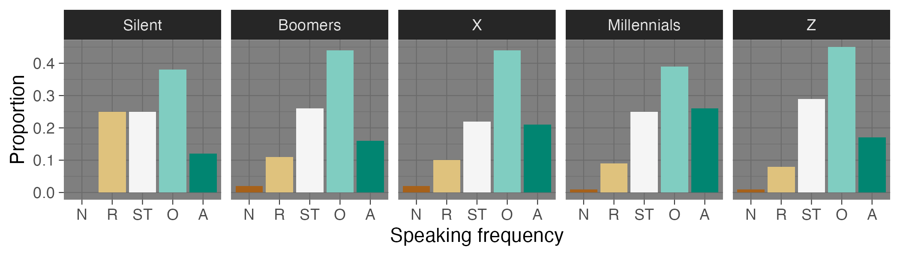{#fig-speak-freq-gen width="\\linewidth"}

Factor 2 *Absolute number of speakers* does not have a dedicated scale in @unesco2003, so we supplement the @unesco2003 scales with the scale from Table 5 in @lee2016.
Based on the absolute number of speakers, we assign level 6 "safe" (note that we reverse the numbering relative to @lee2016 so that it matches [@unesco2003]).
For Factor 3 *Proportion of speakers*, we assign level 2 "A minority speaks the language" [@unesco2003 9], given that level 3 is "A majority of speakers speaks the language".

# Factor 4: Shifts in domains of language use

@fig-domains reports the proportion of use of Gallo-Romance based on topic, people spoken to and places where it is spoken, as self-reported by the respondents in the questions LU01-03.
The responses are divided by cohort generation within each panel.
In @fig-about, a pattern of increasing specialisation can be observed across generations: in particular, Gallo-Romance is used to express anger, for joking and swearing, while other domains like recalling the distant past and telling news, talking about politics and thinking see a sharp decline.

@fig-with further illustrates the narrow domain of use of Gallo-Romance, which is mostly spoken to relatives, friends and the elderly.
We see a decline in use especially with acquaintances and neighbours.
The private and familial nature of Gallo-Romance is further illustrated by the restricted range of places that respondents reported to speak Gallo-Romance in: the home is the place *par excellence*, which sees only a minor drop between the Silent and the Boomers generation.
Of note is the increase of use in pubs, which makes sense in light of the specialisation of topics (the pub being a place of socialisation and amicability, related to joking and anger/swearing).

::: {#fig-domains}
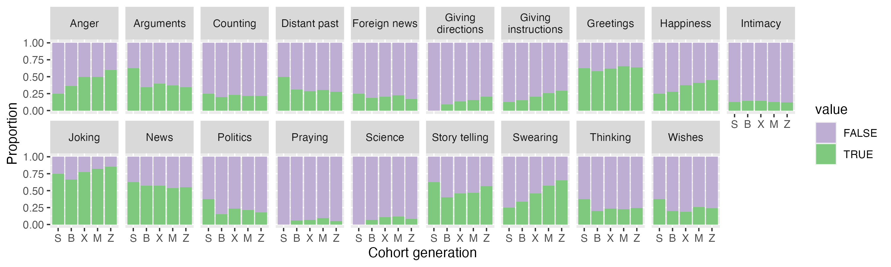{#fig-about}

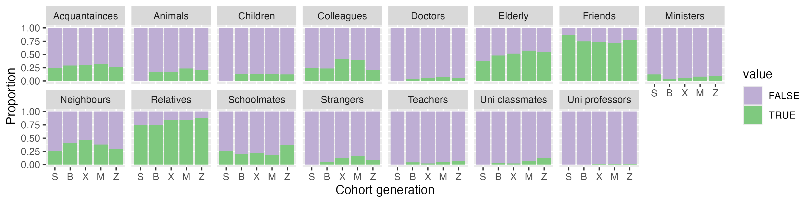{#fig-with}

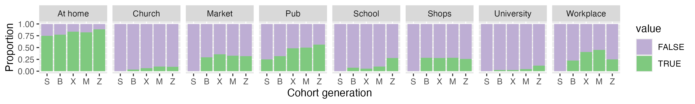{#fig-at}

Proportion of use of Gallo-Romance by topic, people, and places, divided by cohort generation.
:::

Given the current specialisation of Gallo-Romance for specific domains and functions, we assign a level 1 "Critically endangered" to Factor 4: "The language is used only in a very restricted number of domains and for very few functions" [@unesco2003 10].

# Factor 5: Response to new domains and media

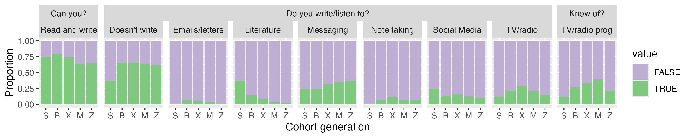{#fig-new-doms width="\\linewidth"}

1)  shows responses in relation to reading, writing and listening to media in Gallo-Romance. The value "FALSE" means that the participant does not do the given reading/writing/listening action, while "TRUE" means they do. While most reported to be able to read and write Gallo-Romance, very few actually do so in new domains and media, with greater but still low usage in messaging than other new domains across all generations. Given the data, we assign Factor 5 to level 1 "Minimal" response to new domains and media [@unesco2003 11].

# Factor 6: Availability of materials for language education and literacy

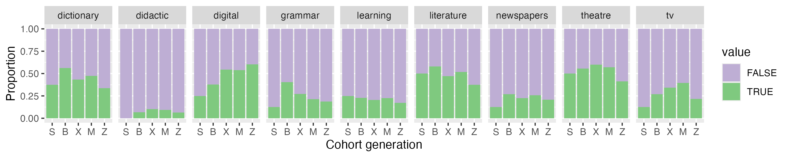{#fig-materials width="\\linewidth"}

@fig-materials shows reported availability of materials for language education and literacy.
While many reported knowing of dictionaries and digital (online) teaching materials, we know these to be limited in scope and sometimes of lesser quality (cf with Factor 9).
In terms of didactic materials, the vast majority of participants reported not knowing about the existence of any.
We assign Factor 6 to level 2: "Written materials exist, but they may only be useful for some members of the community; for others, they may have a symbolic significance. Literacy education in the language is not a part of the school curriculum" [@unesco2003 12].

# Factor 7: Government and institutional attitudes and policies

Governmental and institutional attitudes toward Gallo-Romance have historically been characterised by neglect.
In the 1980s, regions with special statutes began to offer some protection to their local languages.
However, a comprehensive national law recognising and safeguarding Gallo-Romance remains absent.
Although Italy signed the European Charter for Regional or Minority Languages in the 1990s, it has not ratified it, asserting that Law 482/1999 suffices for linguistic protection.
This law, however, only recognises very few languages, excluding many Gallo-Romance glossolects with a few exceptions, such as Occitan and Francoprovençal.

As of the 1990s, many regions implemented language policies, but no national legislation has been enacted to protect Gallo-Romance glossolects not covered by special statutes.
Currently, proposals to recognise these glossolects often face opposition in the media and political spheres, with debates persisting on whether they should be taught in schools or have a viable future.
Notably, at the time of writing, Italy expressed reservation to Spain's recent initiative to have Galician, Basque, and Catalan recognised as EU languages, potentially fearing it could prompt discussions about Northern Italy's Gallo-Romance [@DeLaFeld2025].

Overall, we believe the current situation for Factor 7 aligns with level 3 "Passive assimilation": "No explicit policy exists for minority languages; the dominant language prevails in the public domain" [@unesco2003 14].

# Factor 8: Community members' attitudes towards their own language

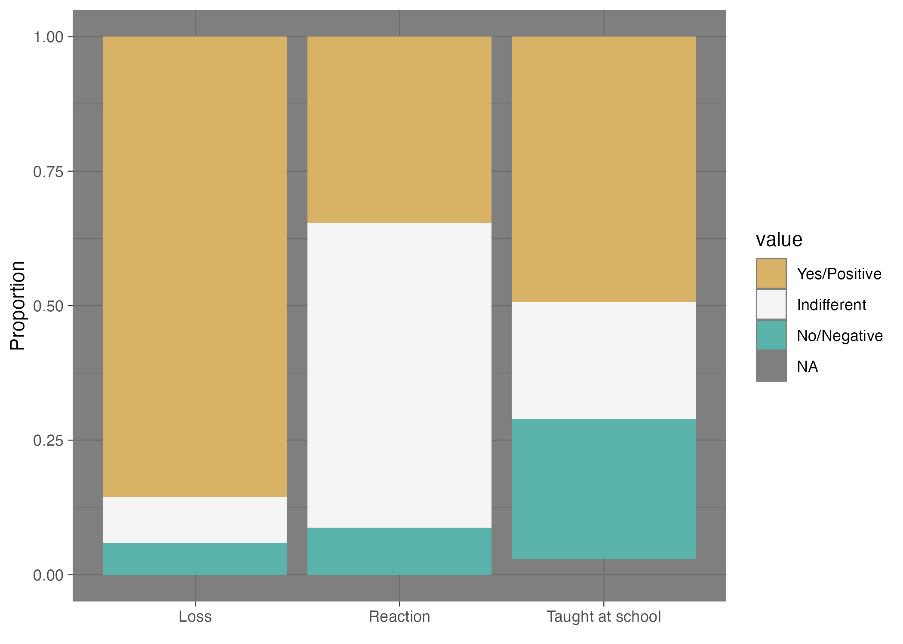{#fig-attitudes width="\\linewidth"}

2)  shows a selection of attitudes: first is the reaction of participants towards the potential loss of Gallo-Romance ("Loss"), second, the reaction participants have towards hearing someone speaking Gallo-Romance ("Reaction") and third their opinion regarding teaching Gallo-Romance in school. While the vast majority of participants agree that if Gallo-Romance would be no longer spoken that would be a loss for the community, there is more caution towards the teaching of Gallo-Romance in schools where about 50% said they would agree. In terms of reaction towards hearing someone speaking Gallo-Romance, the majority reports to be indifferent, followed by a positive reaction and some having a negative reaction. We thus assign Factor 8 to level 4 "Most members support language maintenance" [@unesco2003 15].

# Factor 9: Type and quality of documentation

Gallo-Romance glossolects of Northern Italy show considerable variation in the availability and quality of documentation and description [@himmelmann2006; @dryer2008; @chelliah2010; @payne2014; @bowern2015].
Overall, the existing materials are insufficient to support sustainable language maintenance, especially so when considering language as a form of social and cultural practice (i.e. how these glossolects are used in mundane practices such as preparing food at home @himmelmann2006).
Some of these glossolects benefit from a legacy of grammars, dictionaries, and literary anthologies of various kinds, while many others lack in descriptive work.
In particular, those languages legally protected under Law 482/99 (e.g., Friulian, Ladin, and Occitan) and Romansh in the southern Swiss territory tend to have a better level and quality of linguistic description.
Resources are thus developed unevenly across varieties.

Besides this fragmentation, where resources do exist, they are often outdated.
Many grammars and dictionaries were produced in the 19th or early 20th centuries from a philological perspective and do not necessarily reflect contemporary usage or pedagogical needs.
In this respect, the materials are not learner-oriented.
They are difficult to use in language teaching or revitalisation contexts.
These materials are also hard to access and lack digital tools.
They exist only in print and are often archived in regional libraries.
With the possible exception of Friulian (see <http://saurano.claap.org> for language materials), which is legally protected under Law 482/99, most of these languages lack modern digital corpora, user-friendly orthographic standards, or interactive resources such as apps, online courses, or multimedia materials.
This limits accessibility for wider communities, especially younger generations who rely on digital access.

Although the existence of documentation and description for some varieties cannot be denied, its quality, resilience, pedagogical suitability, and accessibility are not always at a level that supports the revitalisation and maintenance of these languages.

We will now include a few examples of digital resources that can be found online with a focus on the sub-glossolects that are not legally recognised.
This list is not meant to be exhaustive but aims to illustrate the points discussed above.
As the reader will see, some resources (e.g., the Venetan grammar by @garzonio2019grammatica) are compiled with much more scholarly rigour than others.
The following list does not seek to act as an exhaustive inventory, but simply offers examples of resources that can be found online:

-   An exemplary case of atlases on minoritised Romance of Italy are the *Atlante Linguistico Italiano* (Italian Linguistic Atlas, ALI) (<https://www.atlantelinguistico.it>) and the Linguistic and Ethnographic Atlas of Italy and Southern Switzerland ([https://navigais-web.pd.istc.cnr.it/; https://www.ais-reloaded.uzh.ch/](https://navigais-web.pd.istc.cnr.it/;%20https://www.ais-reloaded.uzh.ch/){.uri}).
    AIS is a collection of maps on which are reproduced, for each Italian location explored, the corresponding translations of a concept in the local minoritised Romance glossolect, a notion or a phrase, collected from the speakers' own words by one or more collectors.

-   <https://www.patoisvda.org/it/> provides an online dictionary, a digital grammar, didactic resources for children and for teachers, linguistic atlases, and more.

-   A linguistic profile for Valle d'Aosta and Piedmont is provided by

    3.  

-   <https://piemunteis.it> provides a digital dictionary Piedmontese-Italian and a recent grammar of Piedmontese "La lingua piemontese" by Bruno Villata.
    The website seems to have been launched in 2016 and last updated in 2018.
    An online language course is available at: <https://www.nostereis.org/contatti_e_note.html>

-   A lexicon, corpus of audio recordings, and a dictionary for Swiss sub-glossolects can be found at <https://www4.ti.ch/decs/dcsu/cde/pubblicazioni/vocabolario-dei-dialetti-della-svizzera-italiana> with some of the most recent issues also available online.
    A recent (2021) dictionary with some sections available online can be found at: <https://www4.ti.ch/decs/dcsu/cde/pubblicazioni/vocabolario-dei-dialetti-della-svizzera-italiana>

-   For an online dictionary Grison and German: Dicziunari Rumantsch Grischun, freely available on-line <https://online.drg.ch/>.
    Also see [@guerini2023dialetti; @bianconi1980lingua].

-   @guerini2023dialetti also covers Lombard varieties and <https://www.lengualombarda.org> offers online classes, videos and music.
    Their spell checker app and online dictionary are available at: <http://dizionarilombard.eu5.net>

-   A partial linguistic profile of Trentino (which includes Ladin) is provided in <https://vinkiamo.unitn.it/wp-content/uploads/2024/04/VinKiamoTrentino-Lingue-dialetti_Parte-1.pdf>.
    A recent publication on the linguistic profiles in the area is

    4.  

-   For Venetan, a recent publication see @pescarini2024dialetti.
    Existing grammars include @belloni1991grammatica.
    Language and culture classes were running in schools in 2023 and 2024 <https://www.culturaveneto.it/it/la-tua-regione/storia-e-lingua-veneta-per-le-scuole>.

-   Academia de ła Łengua Veneta is a Venetan Language department of Academia de ła Bona Creansa that ran international conferences in 2017 and 2019 and promote the language by creating materials for children <https://www.academiabonacreansa.eu>

-   For Ligurian, <https://conseggio-ligure.org/en/learn/> lists a language course, a grammar by Fiorenzo Toso (1997), and other resources.

-   Key resources for Emilian include <https://bulgnais.com> and

    5.  The Emilia Romagna Region hosts resources on their webpage dedicated to its regional language <https://patrimonioculturale.regione.emilia-romagna.it/dialetti/risorse-online>.

-   Fabrizio Caveja is a language activist who creates content on Instagram (handle "Rumagnulesta") and runs language classes for Romagnol.
    The Emilia Romagna Region hosts resources on their webpage dedicated to its regional language which includes the link to a language course for Romagnol <https://patrimonioculturale.regione.emilia-romagna.it/dialetti/risorse-online>

In sum, with respect to UNESCO's [-@unesco2003] Factor 9 *Type and Quality of Documentation*, the overall situation of the Gallo-Romance languages of Northern Italy is best described with level 3, "fair".
This means: "There may be an adequate grammar or sufficient numbers of grammars, dictionaries and texts but no everyday media; audio and video recordings of varying quality or degree of annotation may exist" [@unesco2003 16].
We acknowledge that the list of resources presented here is by no means exhaustive of the academic and cultural materials that exist.
However, in the globalised and digitally connected world we live in, the mere existence of resources---particularly when confined to local or municipal library shelves---is not sufficient to ensure the vitality of a language.
For a glossolect to be studied, learnt, used, shared, and ultimately lived, it is essential that such resources be accessible and visible online, where they can reach both local and transnational audiences of all ages.
It is also important to note that many varieties only have grammatical sketches, word lists, and texts that are useful for limited linguistic research, and audio and video recordings may be very limited or entirely absent.
In this respect, especially those varieties that are not legally-recognised lean more towards UNESCO's [-@unesco2003] level 2, "fragmentary".

# UNESCO's (2011) Additional Factors of Language Vitality

@unesco2011 proposes four additional evaluative factors of language vitality that stem from the work of researches on the application of the UNESCO's [-@unesco2003] original nine factors of language vitality that we have discussed so far.
These factors are Factor 10 *Status of Language Programmes*, Factor 11 *Distribution of the Language Community*, Factor 12 *Degree of Internal Variation* and Factor 13 *Transnational Distribution of Language*.
In the next few paragraphs, we will discuss these factors in relation to Gallo-Romance of Northern Italy.
We will start our discussion from Factor 12 and Factor 10, and then move to Factor 11 and Factor 13.

# Factor E12: Degree of internal variation

As for Factor 12 *Degree of Internal Variation*, Gallo-Romance of Northern Italy do not constitute, and cannot be treated as, a single "language".
The term identifies a group of closely related Romance glossolects spoken north of the Massa--Senigallia isogloss [@maidenandparry1997; @tamburelli2018revisiting; @beninca2016].
This group can be characterised as a "dialect" continuum, with varying degrees of mutual intelligibility.
@tbl-translations exemplifies this point, showing how the sentence *Ma vostra nonna non vi fa la polenta tutte le settimane?* "Doesn't your-(PL) grandmother cook polenta every week?" is translated into different contiguous Gallo-Romance glossolects.

|   |   |   |   |   | **Translation** | **Region** | **Province** |
|----|----|----|----|----|:---|:---|:---|
| Mi | vouha granmée | vo-ze fa-tì po | la polenta | totte | le senâ? | Valle d'Aosta | Aosta |
| Ma | vosta nona | a v'la fa nen | la pulenta | tute | le smane? | Piemonte | Torino |
|  | To nona | la fa nenta | la pulenta | tot | al smaini? | Piemonte | Alessandria |
|  | La vosa nona | la va fa mìa | la polénta | tuc | i sétimàn? | Ticino | Locarno |
| Ma | la vosta ava | la va fa miga | la polenta | tucc | i setiman? | Grigioni | Moesa |
| Ma | la vostra nona | ve la fa minga | la pulenta | tutt | i setiman? | Lombardia | Milano |
| Ma | la òsta nóna | v'la fà mia | la pulènta | töte | i setimane? | Lombardia | Bergamo |
| Ma | to nona | no te la fala | la polenta | tute | le setimane | Trentino | Trento |
|  | Vuestri nona | no vi prepara | la polenta | dutis | li setemanis? | Friuli | Udine |
| Ma | vuestre none | no us fasie | le polente | ogni | setemane? | Friuli | Udine |
| Ma | eà vostra nona | non veà fà | eà poenta | tute | e setimane? | Veneto | Venezia |
|  | Vostra nona | nó ve fala mia | la polenta | tute | le stimane? | Veneto | Verona |
|  | A voscia nonna | a vea fa | a pulenta | tutte | e mattin? | Liguria | Savona |
| Mo | vostra nona | av la fala mia | la poleinta | tot | al stmani? | Emilia | Reggio Emilia |
| Mo | la vostra nona | an v'la fa brisa | la pulenta | tote | le stimane? | Emilia | Bologna |
| Mò | vöstra nöna | la n'u v la fa bríša | la pulěñta | tòti | al stmân? | Romagna | Ravenna |
|  | La vósta nòna | l'àn vlá fá | la pulèinta | tòt | al smèni? | San Marino |  |

: Translations of *Ma vostra nonna non vi fa la polenta tutte le settimane?* 'Doesn't your-(PL) grandmother cook polenta every week?' into Gallo-Romance. These are the unedited translations given by the respondents. {#tbl-translations}

These glossolects exhibit significant internal variation, forming a continuum where glossolects at opposite ends may, in some cases not illustrated in @tbl-translations, not be fully mutually intelligible (especially when removing the use of Italian as a *lingua franca*).
We refer the reader to a collection of recordings of the North Wind and the Sun story, available at <https://www.lfsag.unito.it/ark/trm_map.html>.

It is important to note that the informants who answered this question in our survey adopted a non-codified orthography to represent their glossolect.
These spontaneous orthographic systems are often based on Italian, or on speech-community internal conventions on how a sound should be represented.
The latter especially happens if there is not an exact 1-to-1 correspondence with the sound system of the dominant language, namely Italian.
For example, in Venetian, the grapheme \<x\> is used to represent a voiced alveolar fricative /z/ in word-initial position.
A further example is exhibited in Ligurian (cf. line 13 in @tbl-translations where the voiceless palatal-alveolar fricative /ʃ/ which is represented by the digraph \<sc\> as per Italian orthography.

In sum, given the relatively large size of the defined glossolectal area for Gallo-Romance of Northern Italy, a high degree of internal variability is observed.
While @unesco2011 does not provide a scale for this factor, it states that higher degrees of variation are related to lower vitality [@abtahian2017].

# Factor E10: Status of language programmes

The proliferation of different writing conventions leads us directly into the discussion of UNESCO's (2011) Factor 10 *Status of Language Programmes*.
This is evidence that there are no language programmes available in most of these glossolects that would help spread literacy and help reverse the language shift that they are currently undergoing.
It is also interesting to note that for those few glossolects that do enjoy legal status (under the Law 482/99) and that have a codified orthography, speakers do not tend to use it, as shown for Friulian in example (9) in @tbl-translations "vuestri nona no vi prepara la polenta dutis li setemanis?".
The term for grandmother is *none* in the standard orthography, the article *li* in standard Friulian should show plural agreement with the noun, hence *lis*, and finally this particular variety of Friulian does not also show subject-verb "rich" morphological agreement in negative-interrogatives [see @poletto2016subject], hence *preparie*, which tends to be obligatory in Standard Friulian.
This again shows that even if language programmes are in place, the population tends to be rather indifferent to them.

Part of the issue falls back on the discussion of UNESCO's [-@unesco2011] Factor 12 *Degree of Internal Variation*, more specifically because of the speakers' loyalty to their own varieties, whose features are not often reflected in supra-regional standard codified language [for example @lane2017standardizing].
Therefore, for those languages that are protected under the Law 482/1999, if there are programmes available, speakers tend not to respond well to them.
The high degree of internal variation in Gallo-Romance of Northern Italy and, at the same time, the presence of a "dialect" continuum complicates the preservation of these glossolects.
As @unesco2011 points out, the greater the degree of internal variability the lower the vitality.
Gallo-Romance of Northern Italy is characterised by a very high degree of internal variation.
Nevertheless, In the absence of sustained institutional language programmes for the Gallo-Romance languages of Northern Italy---with rare, isolated exceptions at regional level---the burden of language promotion and maintenance falls primarily on grass-roots initiatives.
There are some noteworthy efforts in place among the different speech communities of Northern Italy that aim to preserve and foster the use of non-legally recognised, minoritised glossolects.
We list a few representative ones in the following paragraphs.

Community-driven initiatives exist: in Bologna, where Roberto Serra conducts guided tours in Bolognese; in Modena, where the eco-social charity "Tric e Trac" offers language classes; and in Piacenza, where the council previously supported the "Parlumm Piacentin" initiative, though it appears to have been discontinued.

A particularly notable example is *de_vulgare*, an association for the promotion of local linguistic heritage, which maintains a strong online presence and has gained over 6,000 followers on Instagram.
Through engaging content, collaborative projects, and accessible explanations of language history and news, *de_vulgare* plays an increasingly influential role in shaping public discourse and attitudes toward Gallo-Romance languages of northern Italy, and other minoritised languages.

Similarly, in January 2025, journalist Sophia Smith Galer launched a month-long global challenge to encourage people to learn an endangered or minoritised language.
Although not focused on Gallo-Romance specifically, the initiative attracted several participants choosing Northern Italian glossolects: four studied Emilian, three Ligurian, two Piedmontese, and two Lombard.
While small in scale, this engagement marks an important shift in how younger generations perceive and access these languages---as part of a broader landscape of endangered linguistic diversity rather than as "mere dialects".
Such micro-initiatives demonstrate the potential of informal, self-directed learning and social media engagement to fill the gaps left by the absence of formal programmes.

According to the grading scale for UNESCO's [-@unesco2011] Factor 10 Status of Language Programmes, the situation of the Gallo-Romance languages of Northern Italy is best described by level 2, "basic".
This is defined as: "A program is running involving a small group (\<5 per cent of identifiers) irregularly and with few or no outcomes" [@unesco2011 6].
This level best captures the situation in Northern Italy, where a few enthusiasts of local languages engage in such activities, while the majority of speakers are either unaware of these initiatives or do not participate in them.

# Factor E11: Distribution of the language community

As for Factor 11 *Distribution of the Language Community*, the distribution of Gallo-Romance communities in Northern Italy is marked by both concentration and dispersion, making this a complex factor to assess.
Speakers are traditionally concentrated in well-defined geographic regions but this concentration has been increasingly diluted due to patterns of both internal and external migration.
During the 20th century, large waves of internal migration from Southern Italy to industrialised cities in the North (e.g., Milan, Turin, Genoa) reshaped the linguistic ecology, creating mixed urban communities where regional varieties compete with standard Italian and other migrant languages for relevance and functionality.

In contemporary contexts, new forms of multilingualism are emerging in these regions due to more recent migration flows into Northern Italy.
Immigrant communities (particularly caregivers, domestic workers, and others engaged in intimate or community-facing labour) may develop pragmatic competence in local glossolects, especially in intergenerational settings involving elderly monolingual speakers.
In these cases, local glossolects can become tools for social integration, affective labour, and community building, although they are rarely recognised or valued institutionally in this role [@dagostino2005nuove; @lepschy2005standard; @parry2005nonstandard].

Thus, while the distribution of speakers has become increasingly mixed, the resulting linguistic mosaic can also support language maintenance and revitalisation if approached with appropriate policies and inclusive educational or community practices.

@unesco2011 [6] suggests the following levels: "concentrated, mixed (living together with other ethnic groups), scattered (the more concentrated a community is, the safer its language is)".
We argue that the community is mostly concentrated with some mixing due to immigration and some fragmentation due to emigration.

# Factor E13: Transnational distribution of the language

Finally Factor 13 *Transnational Distribution of Language* is not particular relevant for the assessment of the vitality of Gallo-Romance of Northern Italy as most of these glossolects are spoken within the Italian national territory (with the exception of the Swiss Romance varieties).
Nevertheless, there are a few speech communities outside the Italian territory due to immigration especially during the 19th and 20th century, and they play a role in the preservation and promotion of their ancestral languages.
Venetian, for example, is spoken in parts of Brazil, Argentina, and Mexico, with the Chipilo community in Mexico preserving the language since the 19th century.
Friulian speakers have established associations in countries like Canada, the United States, and Argentina, aiming to maintain their linguistic heritage [for example some recent linguistic research on these varieties include @marcato2002dialetti; @guzzo2023brazilian; @andriania2022documenting; @andriani2022d; @frasson2021clitics; @sbrighi2021language].

Piedmontese has a significant presence in Argentina due to migration in the late 19th and early 20th centuries.
Many Piedmontese settled in the Argentinian provinces of Córdoba and Santa Fe, establishing agricultural colonies where Piedmontese was the primary language.
Over time, language shift occurred due to assimilation pressures, but recent studies indicate ongoing cultural revival efforts [@goria2024piemontese].
Toronto in Canada hosts a community of Piedmontese speakers, with initiatives aimed at documenting and preserving the language among descendants of immigrants [@Villata] (also Endangered Language Alliance Toronto).

The so-called Lombards of Sicily (a folk label), particularly in towns like Piazza Armerina and Aidone, speak Gallo-Italian glossolects introduced by settlers from Northern Italy during the Norman conquest in the 11th century [for example @di2024sulla].

Ligurian speakers have established notable diaspora communities, particularly in Buenos Aires, and especially in the La Boca neighbourhood, Ligurian immigrants from Genoa significantly influenced the local culture and language [@toso2007genovese].
Historical Ligurian-speaking communities existed in Bonifacio (Corsica) and Gibraltar [@bottiglioni1932lingua; @gallen2024relazioni].
The towns of Carloforte and Calasetta are home to Tabarchino, a glossolect of Ligurian brought by settlers from Genoa via Tabarka (Tunisia) in the 18th century [@toso2009tabarchino].
Monégasque, a glossolect of Ligurian, is spoken in Monaco and has been officially taught in schools since 1972 [@lusito2025monegasco].

# Overall assessment

| factor | name | level | description |
|:---|:---|:---|:---|
| 1 | Intergenerational language transmission | 2 | The language is used mostly by the grandparental generation and up. |
| 2 | Absolute number of speakers | 5 | \>100,000 |
| 3 | Proportion of speakers | 2 | A minority speaks the language (20-49%) |
| 4 | Shifts in domains of language use | 1 | The language is used only in a very restricted number of domains and for very few functions. |
| 5 | Response to new domains and media | 1 | The language is used only in a few domains |
| 6 | Availability of materials for language education and literacy | 2 | Written materials exist, but they may only be useful for some members of the community; for others, they may have a symbolic significance. Literacy education in the language is not a part of the school curriculum. |
| 7 | Gov and institutional attitudes and policies | 3 | No explicit policy exists for minority languages; the dominant language prevails in the public domain |
| 8 | Community members' attitudes | 3 | Many members support language maintenance; others are indifferent or may even support language loss. (50-79%) |
| 9 | Type and quality of documentation | 3 | There may be an adequate grammar or sufficient numbers of grammars, dictionaries and texts but no everyday media; audio and video recordings of varying quality or degree of annotation may exist. |
| E10 | Status of language programmes | 2 | A program is running involving a small group (\<5 per cent of identifiers) irregularly and with few or no outcomes. |
| E11 | Distribution of the language community |  | Mostly concentrated with minor presence in scattered communities due to migration. |
| E12 | Degree of internal variation |  | High degree of internal variation due to "dialectal" continuum. |
| E13 | Transnational distribution of language |  | Most of the speaking population concentrated in northern Italy with some small speaking communities outside of Northern Italy. |

: Summary of vitality assessment of Gallo-Romance of Northern Italy. {#tbl-overall}

@tbl-overall shows the assigned levels for each factor.
The levels, taken from @unesco2003, generally correspond, from 0 to 5, to extinct (0), critically endangered (1), severely endangered (2), definitively endangered (3), unsafe (4), and safe (5).
Note that @unesco2011 does not report levels for factors E11-E13 so no attempt was made to assign a level to those factors.
Factors 1 to E10, with the exception of factor 2, lie between 1 and 3 (i.e. critically to definitely endangered).
Factors E11-E12 indicate high variability and fragmentation.
While in absolute terms the population of speakers indicates a "safe" scenario (factor 2), the results from the other factors really downplay the relatively large size of the speaking population, especially given the intergenerational transmission (factor 1) with is quite low.

Overall, we assign a level between "severely endangered" and "definitely endangered".
We believe this conservative stance is necessary in light of the rapid loss of speakers across generations and of the academic and cultural value of Gallo-Romance.
Given the urgency of the scenario that emerged from the study, we hope that more documentation and description efforts will be put in place across academic institutions and grass-root initiatives to preserve and possibly foster the study and use of Gallo-Romance.

# Conclusion

This study set out to assess the vitality of Gallo-Romance of Northern Italy, a Romance glossolect spoken in the northern regions of Italy, in Swiss Ticino and Grigioni cantons and in San Marino.
We defined Gallo-Romance of Northern Italy geographically, rather than genealogically, given the long-standing debates on the internal classification of Romance languages.
We collected 2218 responses from people who were born and/or reside in the selected regions.
The participants filled an online questionnaire, which included several questions formulated to investigate the vitality factors proposed by [@unesco2003; @unesco2011].

Each factor was scored based on the questionnaire data and/or other sources, on a scale from "extinct" (0) to "safe" (5) @unesco2003.
The assigned levels range between "critically endangered" (1) and "definitely endangered" (3), with the exception of factor 2 *Absolute number of speakers*, which given the large target population scored a "safe" (5).
We adopted a conservative stance in giving an overall score of "severely endangered" (2).
We hope that the urgency suggested by these results will prompt further work in assessing the vitality of Gallo-Romance and other Romance glossolects and more efforts to preserve the linguistic and cultural landscape of Southern Europe.

# Acknowledgements {#sec:akn .unnumbered}

\[HIDDEN FOR REVIEW\]

# Appendix: Number of responses by province. {#apx:provinces}

@tbl-resp-num reports number of responses by region and province.
Note that there is no one-to-one correspondence between a region/province and a specific sub-glossolect.
So for example, in Verbano-Cusio-Ossola, a variety of Lombard is spoken, despite being in Piedmont.

| Region                | Province              | n   |
|-----------------------|-----------------------|-----|
| Region                | Province              | n   |
| Emilia-Romagna        | Bologna               | 63  |
|                       | Ferrara               | 18  |
|                       | Forlì-Cesena          | 11  |
|                       | Modena                | 28  |
|                       | Parma                 | 15  |
|                       | Piacenza              | 14  |
|                       | Ravenna               | 9   |
|                       | Reggio nell'Emilia    | 12  |
|                       | Rimini                | 10  |
| Friuli-Venezia Giulia | Gorizia               | 25  |
|                       | Pordenone             | 29  |
|                       | Trieste               | 16  |
|                       | Udine                 | 42  |
| Grigioni              | Bernina               | 1   |
|                       | Moesa                 | 2   |
| Liguria               | Genova                | 48  |
|                       | Imperia               | 10  |
|                       | La Spezia             | 7   |
|                       | Savona                | 15  |
| Lombardia             | Bergamo               | 67  |
|                       | Brescia               | 59  |
|                       | Como                  | 30  |
|                       | Cremona               | 16  |
|                       | Lecco                 | 19  |
|                       | Lodi                  | 12  |
|                       | Mantova               | 22  |
|                       | Milano                | 143 |
|                       | Monza e della Brianza | 25  |
|                       | Pavia                 | 39  |
|                       | Sondrio               | 17  |
|                       | Varese                | 36  |
| Piemonte              | Alessandria           | 18  |
|                       | Asti                  | 19  |
|                       | Biella                | 3   |
|                       | Cuneo                 | 38  |
|                       | Novara                | 24  |
|                       | Torino                | 173 |
|                       | Verbano-Cusio-Ossola  | 8   |
|                       | Vercelli              | 8   |
| San Marino            |                       | 6   |
| Ticino                | Bellinzona            | 14  |
|                       | Blenio                | 1   |
|                       | Leventina             | 1   |
|                       | Locarno               | 17  |
|                       | Lugano                | 26  |
|                       | Mendrisio             | 9   |
|                       | Riviera               | 3   |
|                       | Vallemaggia           | 1   |
| Trentino-Alto Adige   | Bolzano/Bozen         | 10  |
|                       | Trento                | 46  |
| Valle d'Aosta         | Valle d'Aosta         | 19  |
| Veneto                | Belluno               | 44  |
|                       | Padova                | 141 |
|                       | Rovigo                | 31  |
|                       | Treviso               | 206 |
|                       | Venezia               | 123 |
|                       | Verona                | 223 |
|                       | Vicenza               | 146 |

: Number of responses by province. Provinces with zero responses are not included. {#tbl-resp-num}
